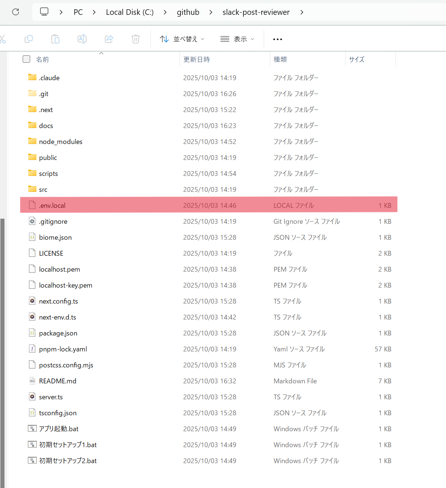

# Slack Post Reviewer

このアプリケーションは、Slack OAuth 認証を使用して、指定した期間の Slack 投稿を検索・表示・エクスポートできるツールです

エクスポートした JSON を GaiXer の評価用テンプレートに使用することで、Slack 上の投稿を効率的に評価できます

### 主な機能

- 📅 期間指定で Slack 投稿を検索（年月選択または詳細な日付指定）
- 💬 チャンネル・DM・グループ DM ごとにフィルタリング可能
- 📊 チャンネル別にグループ化された投稿一覧表示
- 📥 取得データの JSON エクスポート

## 🎨 画面イメージ

※こちらは開発中の画面です（実際の画面とは異なる場合があります）


## 🎉 セットアップ手順

プロジェクトフォルダを開いて、以下の手順で実行してください

○ 手順(1) `初期セットアップ1.bat` をダブルクリックして実行

> [!WARNING]
> `mkcert` を初めてインストールした場合は、手順(2) を実行する前に PC を再起動してください

○ 手順(2) `初期セットアップ2.bat` をダブルクリックして実行

○ 手順(3) [SharePoint](https://officefixer-my.sharepoint.com/:f:/g/personal/eto_koshi24_fixer_co_jp/Esn1_JGQwidBrE2G1-JfxPMBFzmGaLt4JWzJ0uroLWowzw?e=6GbsHo) から `.env.local` ファイルをダウンロードして、プロジェクトルート（`src`ディレクトリと同じ階層）に配置してください

> [!WARNING]
> ダウンロードすると名前が変わるので、`env.download` などになっている場合は `.env.local` にリネームしてください



## 🚀 アプリケーションの起動

`アプリ起動.bat` をダブルクリックして実行

終了するには、ウィンドウで `Ctrl+C` を押してください

---

# ここから下はエンジニア向けの情報です

## 技術スタック

- **フロントエンド**: React 19, Next.js 15, TailwindCSS 4
- **バックエンド**: Next.js App Router, Server-Sent Events (SSE)
- **認証**: iron-session
- **API**: @slack/web-api (Slack 公式 SDK)

## 開発者向けコマンド

コマンドラインから実行する場合:

```bash
# 開発サーバー起動（HTTPS）
pnpm dev

# プロダクションビルド
pnpm build

# プロダクションサーバー起動
pnpm start

# Lintチェック
pnpm lint

# コードフォーマット（自動修正）
pnpm check:fix
```

## プロジェクト構成

```
slack-post-reviewer/
├── src/                          # アプリケーションコード
│   ├── app/                      # Next.js App Router
│   │   ├── api/
│   │   │   ├── auth/slack/      # Slack OAuth認証
│   │   │   ├── slack/           # Slackメッセージ取得API
│   │   │   └── user/            # ユーザー情報取得API
│   │   ├── layout.tsx           # レイアウトコンポーネント
│   │   └── page.tsx             # メインページ
│   ├── lib/
│   │   ├── session.ts           # セッション設定
│   │   └── slack.ts             # Slack APIクライアント
│   └── types/
│       └── slack.ts             # 型定義
├── scripts/                      # PowerShellスクリプト
│   ├── setup1.ps1               # 初期セットアップ1
│   ├── setup2.ps1               # 初期セットアップ2（証明書）
│   └── start.ps1                # アプリ起動
├── 初期セットアップ1.bat         # セットアップバッチ1
├── 初期セットアップ2.bat         # セットアップバッチ2
├── アプリ起動.bat                # アプリ起動バッチ
├── server.ts                     # HTTPSカスタムサーバー
├── .env.local                    # 環境変数（Git管理外）
├── localhost.pem                 # SSL証明書（Git管理外）
└── localhost-key.pem             # SSL秘密鍵（Git管理外）
```

## 使い方

1. **ログイン**: 「Slack にログイン」ボタンをクリック
2. **期間選択**: 年月モードまたは詳細モードで期間を指定
3. **メッセージタイプ選択**: チャンネル/グループ DM/DM から選択
4. **投稿取得**: 「投稿を取得」ボタンをクリック
5. **結果確認**: チャンネル別にグループ化された投稿を確認
6. **エクスポート**: 必要に応じて JSON ダウンロード

## 注意事項

- **処理速度**: 約 100 件あたり 20 秒程度かかります
- **タイムアウト時間**: 10 分でタイムアウトします
- **Rate Limit**: Slack API のレート制限に注意してください
- **HTTPS 必須**: Slack OAuth の仕様上、HTTPS が必要です

## トラブルシューティング

### SSL 証明書エラーが出る場合

`初期セットアップ2.bat` を再度実行してください。

### ポート 3000 が使用中の場合

`アプリ起動.bat` は自動でポート 3000 を使用中のプロセスを終了します。

それでも問題がある場合は、[server.ts](server.ts#L21)の`.listen(3000, ...)`を別のポート番号に変更してください。

### Slack 認証が失敗する場合

1. Slack App の設定を確認
2. Redirect URL が正確に設定されているか確認
3. `.env.local`の環境変数を確認
4. ブラウザのキャッシュをクリア

### バッチファイルで文字化けが発生する場合

PowerShell スクリプト（`scripts/` フォルダ内の `.ps1` ファイル）が UTF-8 with BOM で保存されているか確認してください。

## ライセンス

このプロジェクトはプライベートプロジェクトです。全ての依存パッケージは MIT ライセンスです。

## セキュリティ

- `.env.local`ファイルは絶対に公開リポジトリにコミットしないでください
- SSL 証明書ファイル（`.pem`, `.crt`, `.key`）もコミットしないでください
- `IRON_SESSION_PASSWORD`は十分に複雑な値を使用してください
